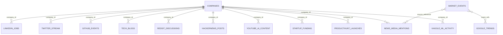

# Dataset Relationships

Primary relationships:

- `company_id` is the core entity key across operational and social datasets.
- `tech_topic`, `topic`, `keyword`, and `tag` represent the same trend taxonomy at different source layers.
- `market_events.csv` encodes shock windows that influence trend spikes, sentiment shifts, volatility, hiring, and funding behavior.
- Funding and hiring are intentionally linked through company-level signals rather than strict one-to-one row joins.
