# TechTrends Project Flow

## Purpose

This project tracks technology trends from multiple sources, converts raw events into structured analytics data, engineers per-technology features, trains ML models, and exposes results through an API and a dashboard.

It supports two modes:

1. Offline local mode using the checked-in dummy CSV data in `Data/`
2. Streaming mode using Kafka plus S3/MinIO

In your current local run, the project is using offline local mode.

## Short Answer: Is ML Integrated?

Yes. ML is integrated in the project.

Current ML usage:

- feature generation from processed records
- supervised classification of technology trend state
- optional time-series forecasting with Prophet
- prediction serving through FastAPI
- dashboard consumption of API outputs

Important distinction:

- `/trends/top` is not using a trained ML model directly. It reads the latest engineered feature files and sorts by `technology_popularity_score`.
- `/forecast/{name}` does use the trained model if one exists.

## End-to-End Architecture

The project flow is:

`Data sources -> ingestion -> normalized records -> processed parquet -> feature engineering -> ML training -> API -> Streamlit dashboard`

There are two ingestion paths.

## Architecture Diagram

```mermaid
flowchart LR
    subgraph Sources["Data Sources"]
        A1["Local CSV Data
        Data/*.csv"]
        A2["Google Trends API"]
        A3["StackOverflow API"]
        A4["GitHub Events API"]
        A5["RSS/Atom Blog Feeds"]
    end

    subgraph Ingestion["Ingestion Layer"]
        B1["LocalProcessor
        processing/local_processor.py"]
        B2["Producers
        producers/*.py"]
        B3["Kafka Topics
        google_trends
        stackoverflow
        github_events
        tech_blogs"]
        B4["S3RawConsumer
        consumers/s3_raw_consumer.py"]
        B5["S3/MinIO Raw JSONL"]
        B6["S3Processor
        processing/processor.py"]
    end

    subgraph Standardization["Normalized Processing"]
        C1["NormalizedRecord Schema
        processing/schemas.py"]
        C2["Processed Parquet
        processed/<source>/<yyyy>/<mm>/<dd>/*.parquet"]
    end

    subgraph Features["Feature Layer"]
        D1["FeatureEngineer
        feature_store/engineer.py"]
        D2["Feature Store Files
        feature_store/features/<tech>/<date>.parquet"]
        D3["technology_popularity_score
        ecosystem_momentum_score
        rolling metrics"]
    end

    subgraph ML["ML Layer"]
        E1["ModelTrainer
        ml/train.py"]
        E2["RandomForest / XGBoost"]
        E3["Optional Prophet Models"]
        E4["Model Artifacts
        ml/models/*.joblib"]
        E5["Metrics / Importances
        ml/artifacts/*.json"]
    end

    subgraph Serving["Serving Layer"]
        F1["FastAPI
        api/app.py"]
        F2["/trends/top"]
        F3["/forecast/{name}"]
        F4["/features/{name}
        /technology/{name}
        /health"]
        F5["Streamlit Dashboard
        dashboard/streamlit_app.py"]
    end

    A1 --> B1
    B1 --> C1
    C1 --> C2

    A2 --> B2
    A3 --> B2
    A4 --> B2
    A5 --> B2
    B2 --> B3
    B3 --> B4
    B4 --> B5
    B5 --> B6
    B6 --> C1

    C2 --> D1
    D1 --> D2
    D1 --> D3

    D2 --> E1
    D3 --> E1
    E1 --> E2
    E1 --> E3
    E2 --> E4
    E3 --> E4
    E1 --> E5

    D2 --> F1
    E4 --> F1
    E5 --> F1
    F1 --> F2
    F1 --> F3
    F1 --> F4
    F2 --> F5
    F3 --> F5
    F4 --> F5
```



### Diagram Reading Guide

- Left side shows the two input modes:
  - local CSV input
  - live APIs through Kafka and S3/MinIO
- Middle shows normalization, parquet generation, and feature engineering
- ML layer trains models from engineered feature files
- FastAPI serves both analytics-style endpoints and ML predictions
- Streamlit is only a UI client on top of the API

### Your Current Active Path

In your current local run, only this path is active:

```text
Data/*.csv
-> LocalProcessor
-> processed parquet
-> FeatureEngineer
-> feature files
-> ModelTrainer
-> FastAPI
-> Streamlit
```

The Kafka and S3/MinIO path exists in the repo, but it is not being used unless you explicitly start that infrastructure and run the producers/consumers.

### Path A: Offline local path

This is what your system is currently running.

1. CSV files in `Data/` are read by `processing/local_processor.py`
2. Data is normalized into a shared schema
3. Daily parquet files are written under `processed/`
4. `feature_store/engineer.py` reads those parquet files and builds per-technology daily features
5. `ml/train.py` reads feature files and trains models
6. `api/app.py` reads local feature/model artifacts and serves endpoints
7. `dashboard/streamlit_app.py` calls the API and renders charts

### Path B: Streaming path

This path is available but is not what your current dashboard is using.

1. Producers fetch live data from external systems
2. Producers publish events to Kafka topics
3. `consumers/s3_raw_consumer.py` writes raw Kafka messages to S3/MinIO as JSONL
4. `processing/processor.py` reads JSONL objects from S3/MinIO
5. Normalized parquet is written to `processed/`
6. Feature engineering, ML training, API, and dashboard run the same as the offline path

## Data Sources

### Expanded synthetic market-intelligence corpus

The local dataset has been regenerated into a larger 2025-2026 synthetic corpus designed for ML, dashboards, market intelligence, trend forecasting, sentiment analysis, recommendations, and anomaly detection.

Current generated scale:

- Total rows: `208387`
- Date range: `2025-01-01` to `2026-04-30`
- Countries: United States, India, United Kingdom, Germany, Canada, Singapore, United Arab Emirates, Japan, China, France
- Topics: AI Agents, LLM, Generative AI, Cybersecurity, Cloud Computing, DevOps, Edge AI, Robotics, Web3, Semiconductors, SaaS, Data Engineering, Automation, MLOps, Open Source AI, GPU Infrastructure, Developer Tools, Vector Databases, Inference Optimization, Enterprise AI

Generated support assets:

- `Data/market_intel/DATASET_CATALOG.md`
- `Data/market_intel/RELATIONSHIPS.md`
- `imports/postgres_schema.sql`
- `imports/mongoimport_examples.ps1`
- `imports/elasticsearch_bulk_examples.ps1`
- `samples/api/*.json`
- `samples/json/*.json`

### Offline local datasets

The repo includes these local CSV files in `Data/`:

- `linkedin_jobs.csv`
- `twitter_stream.csv`
- `github_events.csv`
- `tech_blogs.csv`
- `stackoverflow_questions.csv`
- `google_trends.csv`

Dataset summary from `Data/dataset_summary.json`:

- LinkedIn jobs: `3000`
- Twitter stream: `6000`
- GitHub events: `2500`
- Tech blogs: `1200`
- StackOverflow questions: `3500`
- Google Trends rows: `744`
- Date range: `2026-01-01` to `2026-01-31`

### Streaming producers

The streaming side fetches from:

- Google Trends via `pytrends`
- StackOverflow API
- GitHub public events API
- RSS/Atom blog feeds

Files:

- `producers/google_trends_producer.py`
- `producers/stackoverflow_producer.py`
- `producers/github_producer.py`
- `producers/blog_producer.py`

## Module-by-Module Flow

## 1. Configuration

File:

- `config/settings.py`

Responsibilities:

- loads `.env`
- defines Kafka topics and intervals
- defines S3/MinIO settings
- defines output directories
- ensures state and output directories exist

Important runtime directories:

- `processed/`
- `feature_store/features/`
- `ml/models/`
- `ml/artifacts/`
- `.state/`

## 2. Ingestion Layer

### A. Local ingestion

File:

- `processing/local_processor.py`

What it does:

- reads CSV files from `Data/`
- validates key columns
- deduplicates records
- maps source-specific fields into one normalized schema
- writes parquet partitioned by source and date

Normalized schema is defined in:

- `processing/schemas.py`

The normalized record contains:

- `source`
- `id`
- `timestamp`
- `title`
- `text`
- `tags`
- `url`
- `techs`
- `raw`

Why this matters:

Every source has a different shape. The project first converts them into a common record format before feature engineering.

### B. Streaming ingestion

Files:

- `main.py`
- `utils/kafka_utils.py`
- `consumers/base_consumer.py`
- `consumers/s3_raw_consumer.py`

What it does:

- starts producers
- publishes messages to Kafka
- optionally prints raw consumed messages
- optionally batches raw Kafka messages into JSONL files in S3/MinIO

Kafka topics used by default:

- `google_trends`
- `stackoverflow`
- `github_events`
- `tech_blogs`

The S3 raw consumer writes lines like:

```json
{"topic":"github_events","partition":0,"offset":12,"timestamp":1748001014000,"ingested_at":"2026-05-23T14:30:15.123456+00:00","payload":{"id":"123","type":"PushEvent"}}
```

## 3. Processing Layer

There are two processors:

- `processing/local_processor.py` for local CSV input
- `processing/processor.py` for S3/MinIO JSONL input

### Local processor

Output:

- deterministic daily parquet files

Example shape:

- `processed/linkedin_jobs/2026/01/01/2026-01-01.parquet`

### S3 processor

What it does:

- reads JSONL from object storage
- parses each raw record
- infers topic if needed
- normalizes it into the shared schema
- deduplicates within a file
- writes parquet partitioned by source and day
- tracks processed S3 keys with checkpoints

Checkpoint file:

- `.state/processing_checkpoints.json`

## 4. Feature Engineering Layer

File:

- `feature_store/engineer.py`

This is the first real ML-preparation stage.

What it reads:

- all parquet files under `processed/`

What it writes:

- per-technology feature parquet files under `feature_store/features/`
- one consolidated feature dataset at `feature_store/features_all.parquet`

Example output:

- `feature_store/features/python/2026-01-12.parquet`
- `feature_store/features_all.parquet`

### How features are built

The code:

1. loads all processed parquet files
2. explodes the `techs` list so each technology becomes its own row
3. aggregates daily counts by technology and source
4. computes source-specific metrics
5. computes rolling-window signals
6. computes composite scores

### Source-specific feature examples

LinkedIn-derived:

- `job_postings`
- `avg_salary`
- `unique_roles`
- `skill_count`

Twitter-derived:

- `twitter_count`
- `sentiment_avg`
- `engagement_sum`

GitHub-derived:

- `github_events`
- `stars_sum`
- `forks_sum`
- `contributors_n`

StackOverflow-derived:

- `so_questions`
- `avg_answers`
- `accepted_rate`

Google Trends-derived:

- `trend_score_avg`

Blog-derived:

- `blog_posts`
- `blog_views_avg`

### Rolling and derived features

Examples:

- `mentions_7d_mean`
- `mentions_30d_mean`
- `mentions_7d_sum`
- `job_postings_7d_sum`
- `github_events_7d_sum`
- `github_authors_7d_sum`
- `mentions_velocity`
- `mentions_growth_pct`
- `engagement_velocity`
- `salary_growth_pct`
- `mentions_spike`

### Important composite scores

These are central to the project.

#### `technology_popularity_score`

This is a weighted score combining multiple signals:

- mention volume
- trend signal
- GitHub contributor activity
- job posting volume

This score is later used:

- as a ranking signal for `/trends/top`
- as the training target basis for ML labels

#### `ecosystem_momentum_score`

This captures short-term movement using:

- mention velocity
- engagement velocity
- GitHub event activity

## 5. ML Layer

File:

- `ml/train.py`

Yes, this project contains actual ML logic, not just analytics.

### What the ML model predicts

It predicts the future trend class of a technology.

Label classes:

- `booming`
- `stable`
- `declining`

### How labels are created

The project does not use a manually labeled dataset.

Instead, it creates labels from future movement in `technology_popularity_score`.

Flow:

1. load per-technology features
2. shift popularity score forward by `horizon_days` default `7`
3. compute future growth percentage
4. convert that growth into classes

Current labeling logic:

- if future growth > `0.2` -> `booming`
- if future growth < `-0.1` -> `declining`
- otherwise -> `stable`

This means the ML task is supervised classification using self-generated labels from historical trend behavior.

### Models trained

Baseline:

- `RandomForestClassifier`

Optional:

- `XGBoostClassifier` if `xgboost` is installed

Optional additional forecasting:

- `Prophet` models per technology

### Training flow

1. load all feature files
2. build dataset with labels
3. choose numeric feature columns
4. run time-aware cross-validation
5. train holdout model
6. compare RandomForest and XGBoost
7. save the best model artifact
8. save training metrics and feature importances
9. optionally train Prophet models per technology

For local performance, training first looks for `feature_store/features_all.parquet`. This avoids scanning thousands of small feature files when the synthetic corpus is large.

### ML artifacts written

Model files:

- `ml/models/model_<timestamp>.joblib`

Metrics:

- `ml/artifacts/metrics_<timestamp>.json`

Feature importances:

- `ml/artifacts/feature_importances_<timestamp>.json`

Optional Prophet models:

- `ml/models/prophet/prophet_<tech>_<timestamp>.joblib`

### What is inside the main saved model artifact

The `.joblib` model artifact stores:

- trained model object
- `feature_columns`
- `trained_at`
- `holdout_confidence`
- `feature_importances`

## 6. API Layer

File:

- `api/app.py`

The API reads local artifacts from disk. It does not retrain models or regenerate features on request.

### Endpoint behavior

#### `/health`

Returns service health status.

#### `/trends/top`

Reads the latest feature file for each technology and sorts by `technology_popularity_score`.

This endpoint is:

- analytics-driven
- based on local feature files
- not a direct ML prediction endpoint

#### `/features/{name}`

Returns the latest engineered feature row for a technology.

#### `/technology/{name}`

Returns technology plus latest feature row.

#### `/forecast/{name}`

This is the main ML endpoint.

Behavior:

1. load latest feature row for the technology
2. load latest trained model artifact
3. build model input using saved feature columns
4. run prediction
5. optionally compute confidence from `predict_proba`
6. optionally load Prophet model for numeric forecast enrichment
7. return prediction payload

Forecast response includes:

- `technology`
- `predicted_growth`
- `confidence`
- `trend`
- `features`
- `feature_importances`

### Important distinction

The API serves local files created by your pipeline:

- local processed parquet
- local feature parquet
- local model artifacts

So in your current setup, the dashboard data is:

`Streamlit -> FastAPI -> local artifacts generated from dummy CSV data`

## 7. Dashboard Layer

File:

- `dashboard/streamlit_app.py`

What it does:

- calls `GET /trends/top?limit=...`
- builds a bar chart
- accepts a technology name for forecast lookup
- calls `GET /forecast/{name}`
- renders confidence, growth, feature importances, and raw JSON

The dashboard is a thin UI layer.

It does not process source data itself.

## 8. Entry Scripts

### `scripts/run_pipeline.py`

This is the main orchestration script for local runs.

Flow:

1. if `Data/` exists, use `LocalProcessor`
2. otherwise use `S3Processor`
3. run feature engineering
4. run model training

### `scripts/generate_demo_data.py`

Generates mock raw JSONL objects and uploads them to S3/MinIO.

### `scripts/smoke_demo.py`

Runs a quick demo:

1. generate demo raw data
2. run the pipeline
3. optionally ping the API

### `scripts/check_outputs.py`

Counts generated parquet/model files so you can verify output existence.

## 9. What Happened in Your Current Local Run

When you ran:

```powershell
python -m scripts.run_pipeline
```

the project did this:

1. detected `Data/`
2. skipped Kafka and S3 entirely
3. processed local CSV data into parquet
4. generated features for `24` technologies
5. attempted ML training
6. loaded or saved outputs on local disk

After training and API startup:

- `http://localhost:8000/trends/top` serves latest ranking data from local feature files
- `http://localhost:8000/forecast/{tech}` serves ML predictions from the saved model artifact
- `http://localhost:8501` visualizes that API response

## 10. Current ML Usage Summary

If you want the short version:

- raw source data is transformed into structured features
- a popularity score is engineered
- future growth of that score is converted into labels
- ML predicts whether a technology is booming, stable, or declining
- the API serves those predictions
- the dashboard displays the results

So yes, ML is genuinely part of the current project, but only part of the API uses it.

### ML is used directly in:

- `ml/train.py`
- `api/app.py` endpoint `/forecast/{name}`

### ML is not directly used in:

- raw ingestion
- parquet generation
- `/health`
- `/trends/top` ranking endpoint

## 11. Current Limitations and Design Notes

These are important to understand the current state of the repo.

- The local dashboard is based on dummy local CSV data unless you switch to the streaming path.
- `/trends/top` is feature-ranking logic, not trained model inference.
- Labels are derived from future popularity score movement, not human annotations.
- The pipeline is batch-oriented even in local mode.
- There is no scheduler in the repo yet.
- There is no external feature store service; feature files are parquet on disk.
- Model registry and experiment tracking are not wired into runtime flow even though `mlflow` is in dependencies.

## 12. File Map

Core files by responsibility:

- `config/settings.py` : configuration and runtime paths
- `main.py` : starts producers and consumers
- `utils/kafka_utils.py` : Kafka helpers
- `producers/*.py` : live source ingestion
- `consumers/base_consumer.py` : debug consumer
- `consumers/s3_raw_consumer.py` : Kafka to S3/MinIO raw persistence
- `processing/schemas.py` : normalized schema definitions
- `processing/local_processor.py` : CSV to parquet offline processing
- `processing/processor.py` : S3 JSONL to parquet processing
- `feature_store/engineer.py` : feature engineering
- `ml/train.py` : model training and artifact saving
- `api/app.py` : prediction and analytics API
- `dashboard/streamlit_app.py` : UI dashboard
- `scripts/run_pipeline.py` : local orchestration
- `scripts/generate_demo_data.py` : mock streaming input generation
- `scripts/check_outputs.py` : output verification

## 13. Recommended Mental Model

If you want to understand the repo quickly, think of it in five stages:

1. Collect signals from tech ecosystems
2. Standardize them into one common format
3. Convert them into daily per-technology features
4. Train a model to classify future trend state
5. Serve those results through API and dashboard

That is the current project in one sentence.
